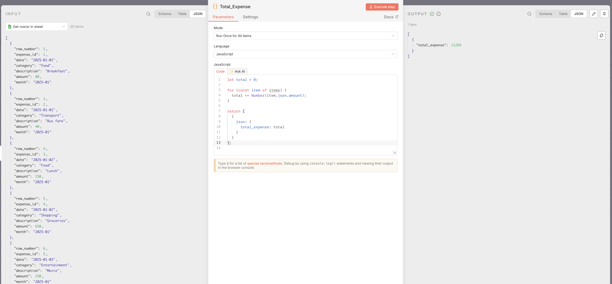
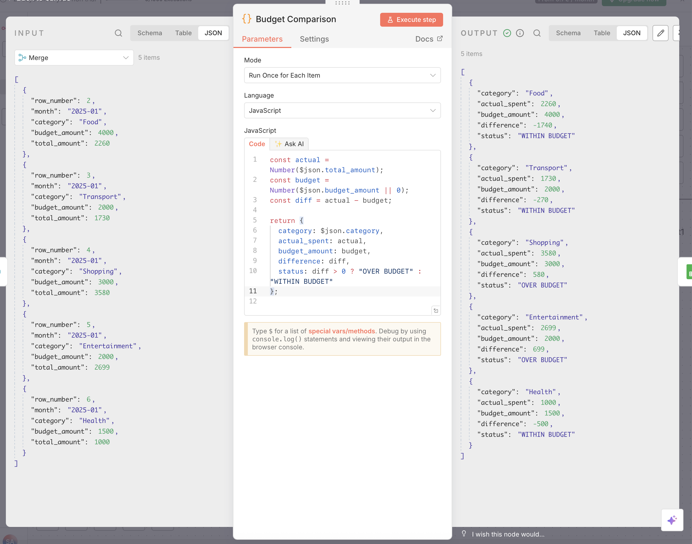
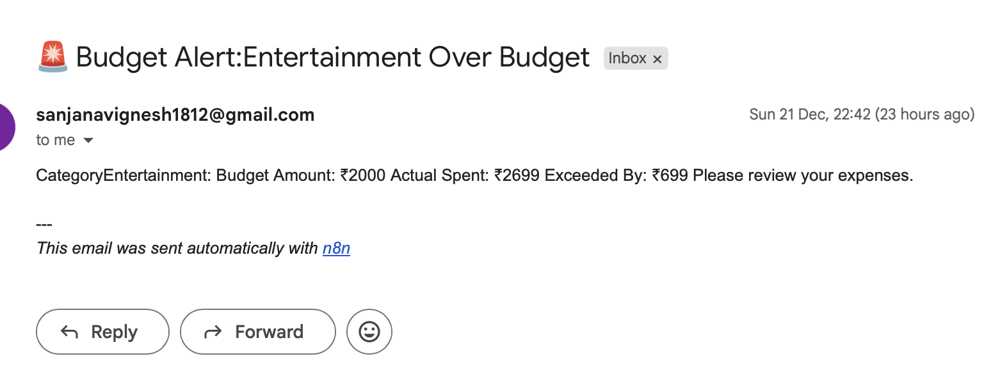

# 💡 Smart Expense Analytics & Budget Monitoring

## 📊 Overview

Smart Expense Analytics & Budget Monitoring is an end-to-end analytics and automation project that transforms raw daily expense data into **actionable financial insights**.

The project reads expense and budget data from Google Sheets, processes it using **SQL-style aggregation logic implemented through n8n**, and automatically **triggers alerts when spending exceeds predefined budgets**.

This project demonstrates a complete **data → analysis → decision → action** workflow, similar to real-world finance and analytics systems.

---

## 🎯 Problem Statement

Manually tracking expenses provides data but not insights.

Common challenges include:
- No clear visibility into total spending
- Difficulty identifying high-spend categories
- No automatic indication when budgets are exceeded

This project solves these problems by automating expense analysis and generating alerts when overspending occurs.

---

## 🧠 Core Idea

> **Analyse expenses → detect overspending → trigger alerts**

This project does not stop at reporting.  
It converts insights into **automated actions**, which is the real goal of analytics systems.

---

## 🏗️ Architecture

Google Sheets (Expenses & Budgets)
↓
n8n Workflow
↓
SQL-style Aggregation Logic
↓
Budget Comparison
↓
Overspending Alerts

---

## ⚙️ n8n Workflow – Step-by-Step

### Step 1: Expense Data Input

Daily expenses are stored in Google Sheets and read into the n8n workflow.

---

### Step 2: Total Expense Calculation

The workflow calculates the total amount spent across all expense entries.

**Purpose**
- High-level spending visibility
- Monthly expense KPI

---

### Step 3: Category-wise Expense Analysis

Expenses are grouped by category to understand where money is being spent.

**Purpose**
- Identify high-spending categories
- Enable budget comparison

---

### Step 4: Monthly Expense Aggregation

Expenses are aggregated on a monthly basis to analyse spending trends.

**Purpose**
- Month-on-month analysis
- Trend visibility

---

### Step 5: Budget vs Actual Comparison

Actual category-wise expenses are compared with predefined monthly budgets.

**Output Includes**
- Category
- Actual spent amount
- Budget amount
- Difference
- Status (OVER / WITHIN budget)

This mirrors real-world financial reporting logic.

---

### 🚨 Step 6: Overspending Alert (Core Feature)

When a category exceeds its budget, the workflow automatically triggers an alert.

**Alert Contains**
- Category name
- Budget amount
- Actual spending
- Overspent difference

This completes the **analytics → action** loop.

---
**Tools used**

- Google Sheets – Data storage
- n8n – Workflow automation
- SQL – Data aggregation logic
- GitHub – Documentation and version control
