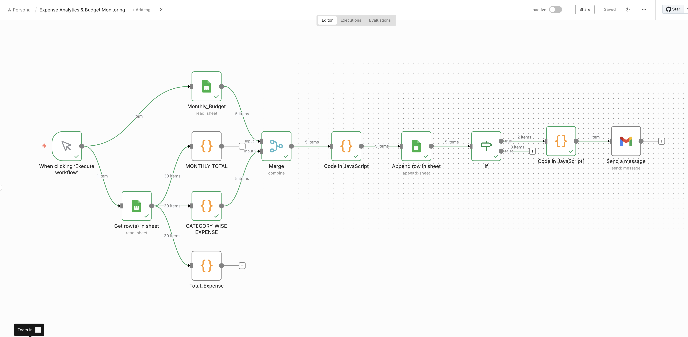
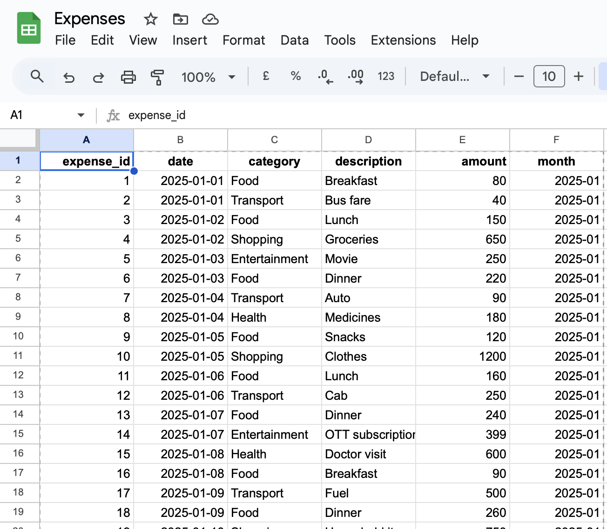
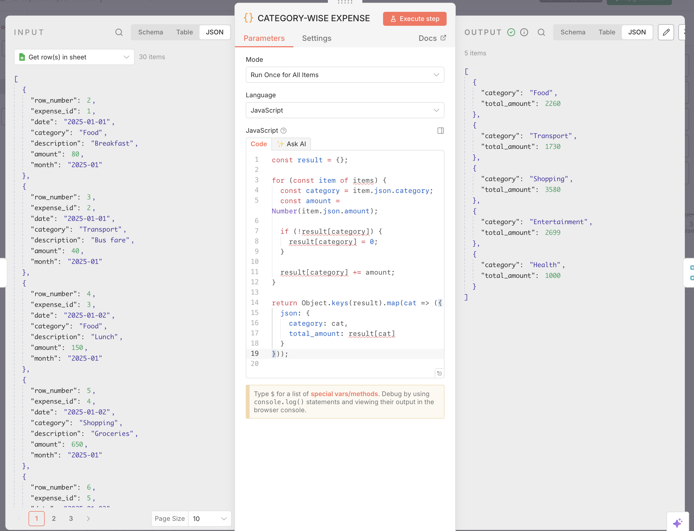
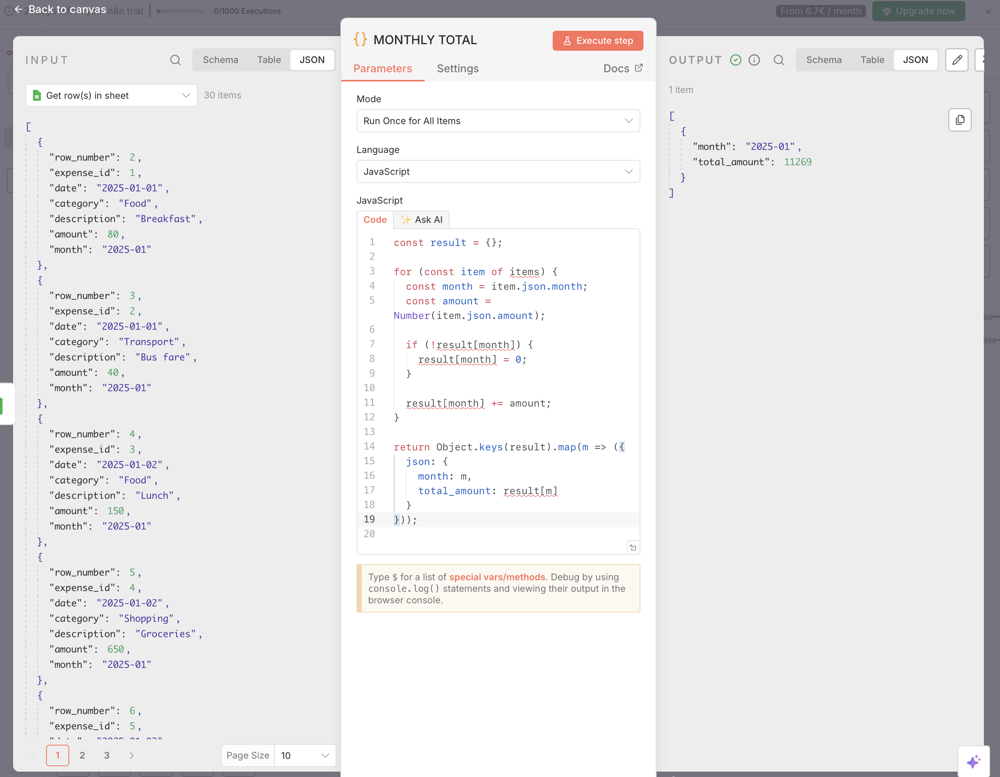

# Smart Expense Analytics Budget Monitoring
## Overview

Smart Expense Analytics & Budget Monitoring is a beginner-friendly data analytics and automation project that analyses personal expense data and generates meaningful insights using SQL-style logic and n8n workflows.

The project focuses on transforming raw expense entries into structured summaries such as total spending, category-wise expenses, and monthly totals, while maintaining a clean and visual GitHub presentation.

## Problem Statement

Tracking daily expenses manually often leads to poor visibility into spending patterns.
Without proper aggregation, it becomes difficult to understand:
- Where most of the money is spent
- Monthly spending behaviour
- Category-wise expense distribution

This project solves the problem by automating expense analysis and presenting clear summaries using data analytics techniques.

## Architecture

The project follows a simple and practical data flow:

Google Sheets → n8n Automation → Aggregated Outputs → SQL-style Analysis


## n8n Workflow Explanation

The automation workflow performs the following steps:

1. Reads expense data from Google Sheets
2. Calculates the total expense amount
3. Groups expenses by category and calculates category-wise totals
4. Aggregates expenses on a monthly basis
5. Outputs clean and structured results for analysis and reporting




### Raw Expense Data


### Category-wise Expense Output


### Monthly Expense Output


## SQL Logic Used

Although the data processing is automated using n8n, the aggregation logic mirrors standard SQL queries.

### Total Expense
```sql
SELECT SUM(amount) AS total_expense
FROM expenses;

**### Monthly Expense**
SELECT month, SUM(amount) AS monthly_total
FROM expenses
GROUP BY month;

**### Category-wise Expense**
SELECT month, SUM(amount) AS monthly_total
FROM expenses
GROUP BY month;

---

## Tools Used

- Google Sheets – Data storage
- n8n – Workflow automation
- SQL – Data aggregation logic
- GitHub – Project documentation and version control

